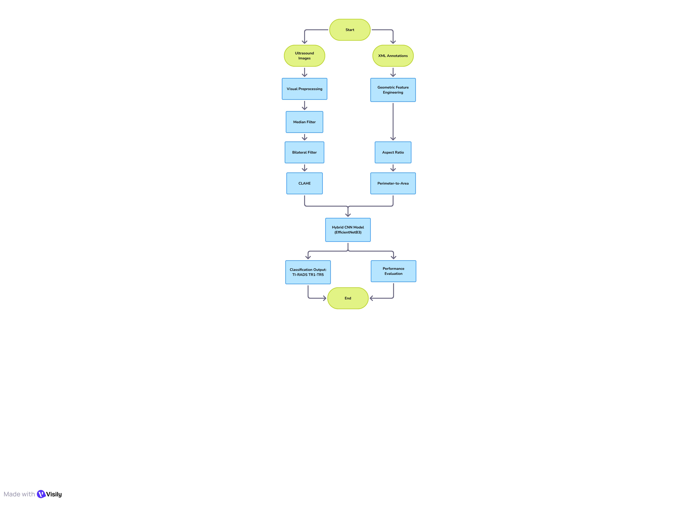

# AI-Thyroid-TIRADS4-Classification
A hybrid deep learning system combining DenseNet121 and morphological analysis for enhanced classification of TIRADS 4 thyroid nodules.
# Hybrid-DenseNet121 for Thyroid Nodule Classification (TIRADS 4)

## 📌 Project Overview
This project presents a state-of-the-art **Hybrid AI System** specifically engineered to tackle the diagnostic challenges of the "Gray Zone" in thyroid nodules (**ACR TI-RADS 4**). 

The system leverages a dual-pathway approach:
1. **Deep Learning Path:** Utilizing **DenseNet121** for intricate texture analysis.
2. **Morphological Path:** Integrating clinical geometric features (Width, Height, Aspect Ratio, etc.).

This synergy mimics a radiologist's expertise, leading to more accurate differentiation between benign and malignant cases within the TI-RADS 4 sub-types (4a, 4b, and 4c).

## 👥 Authors
* **Mahmoud Ali Souliman** - Biomedical & AI_ML Engineer
* **Areej Jehad Al-Ahmed** - Dermatologist & AI_ML Engineer 
* **Supervisor:** Dr. Mohammad Al-Shayta
* **Institution:** Syrian Virtual University (SVU) - ITE_ML Program

## 🚀 Technical Innovation & Methodology
### 1. Sub-Polarization Training Strategy
To overcome the overlapping features in the TIRADS 4 category, we implemented a **Sub-Polarization Strategy**, focusing the initial learning on the extreme ends of the spectrum (4a vs. 4c). This approach significantly improved the model's ability to identify early-stage malignancy.

### 2. Hybrid Feature Fusion
Instead of relying solely on raw pixels, our model concatenates:
- **1024 Deep Features** extracted via DenseNet121.
- **6 Geometrical Features** (Width, Height, Actual Area, Perimeter, Aspect Ratio, and P-to-A Ratio) extracted from the manual segmentation data.

### 3. Surgical Fine-Tuning
We applied a precise fine-tuning strategy by unfreezing only the **last 60 layers** of the DenseNet121 architecture, allowing the model to adapt to the specific grayscale nuances of ultrasonic imagery while preserving global ImageNet knowledge.

### 4. Morpho-Boost Decision Logic
A custom-built **post-processing algorithm** that adjusts the CNN's probability based on morphological evidence. For instance, nodules with an Aspect Ratio > 1.1 (Taller-than-wide) receive an automatic sensitivity boost, reducing the false-negative rate in malignant cases.

## 📊 Key Results
- **Optimized Recall:** Using a class-weighting strategy (1.8x penalty for missed malignant cases).
- **Architecture:** Pre-trained DenseNet121 + Global Average Pooling + Fully Connected Hybrid Layers.

## 🛠️ Installation & Usage
### Prerequisites
- Python 3.8+
- TensorFlow 2.x
- OpenCV, Scikit-image, Pandas, NumPy

### Execution
1. Clone the repository:
   ```bash
   git clone [https://github.com/YourUsername/Thyroid-Hybrid-DenseNet121.git](https://github.com/YourUsername/Thyroid-Hybrid-DenseNet121.git)
